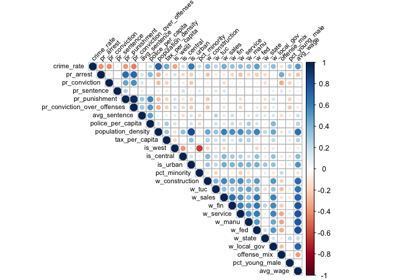

Modeling
================

``` r
library(dplyr) 
```

    ## 
    ## Attaching package: 'dplyr'

    ## The following objects are masked from 'package:stats':
    ## 
    ##     filter, lag

    ## The following objects are masked from 'package:base':
    ## 
    ##     intersect, setdiff, setequal, union

``` r
library(ggplot2)
library(knitr)
library(corrplot)
```

    ## corrplot 0.84 loaded

``` r
library(stargazer)
```

    ## 
    ## Please cite as:

    ##  Hlavac, Marek (2018). stargazer: Well-Formatted Regression and Summary Statistics Tables.

    ##  R package version 5.2.2. https://CRAN.R-project.org/package=stargazer

# Correlation Plot

## load processed data

``` r
crime_data <- read.csv('/Users/CecilyS/Desktop/MIDS_UCB/W203_Stat/Homework/lab_3_team_5/data/processed/crime_v2.csv')
```

``` r
crime_cols <- crime_data[c('crime_rate', 'pr_arrest', 'pr_conviction', 'pr_sentence', 'pr_punishment', 'pr_conviction_over_offenses',
                           'avg_sentence', 'police_per_capita',
                           'population_density', 'tax_per_capita', 'is_west', 'is_central', 'is_urban', 'pct_minority',
                           'w_construction', 'w_tuc', 'w_sales', 'w_fin', 'w_service', 'w_manu', 'w_fed', 'w_state', 'w_local_gov', 
                           'offense_mix', 'pct_young_male', 'avg_wage')]

crime_cols_cor = cor(crime_cols)
corrplot(crime_cols_cor, type = "upper", tl.col = "black", tl.srt = 45, tl.cex = 0.7)
```

<!-- -->

# Building models

### model 1 - hypothesis is that if we make the law more strict, meaning that increase the probability of arrests and convictions, we can decrease the crime rate

``` r
model1 <- lm(crime_rate ~ pr_arrest + pr_conviction , data=crime_data)
summary(model1)
```

    ## 
    ## Call:
    ## lm(formula = crime_rate ~ pr_arrest + pr_conviction, data = crime_data)
    ## 
    ## Residuals:
    ##       Min        1Q    Median        3Q       Max 
    ## -0.037274 -0.009356 -0.001645  0.007259  0.050188 
    ## 
    ## Coefficients:
    ##                Estimate Std. Error t value Pr(>|t|)    
    ## (Intercept)    0.071207   0.005464  13.033  < 2e-16 ***
    ## pr_arrest     -0.064583   0.012205  -5.291 8.96e-07 ***
    ## pr_conviction -0.036802   0.006748  -5.454 4.56e-07 ***
    ## ---
    ## Signif. codes:  0 '***' 0.001 '**' 0.01 '*' 0.05 '.' 0.1 ' ' 1
    ## 
    ## Residual standard error: 0.01511 on 87 degrees of freedom
    ## Multiple R-squared:  0.3745, Adjusted R-squared:  0.3602 
    ## F-statistic: 26.05 on 2 and 87 DF,  p-value: 1.364e-09

### model 2 - adding covariates that may have impact on probability of arrest and probability of conviction

``` r
model2 <- lm(crime_rate ~ pr_arrest + pr_conviction + population_density + pct_young_male, data=crime_data)
summary(model2)
```

    ## 
    ## Call:
    ## lm(formula = crime_rate ~ pr_arrest + pr_conviction + population_density + 
    ##     pct_young_male, data = crime_data)
    ## 
    ## Residuals:
    ##       Min        1Q    Median        3Q       Max 
    ## -0.022815 -0.006932 -0.001889  0.005236  0.044385 
    ## 
    ## Coefficients:
    ##                      Estimate Std. Error t value Pr(>|t|)    
    ## (Intercept)         0.0346116  0.0076725   4.511 2.05e-05 ***
    ## pr_arrest          -0.0325441  0.0099932  -3.257 0.001621 ** 
    ## pr_conviction      -0.0208519  0.0054591  -3.820 0.000253 ***
    ## population_density  0.0071107  0.0008755   8.122 3.21e-12 ***
    ## pct_young_male      0.1054139  0.0534425   1.972 0.051807 .  
    ## ---
    ## Signif. codes:  0 '***' 0.001 '**' 0.01 '*' 0.05 '.' 0.1 ' ' 1
    ## 
    ## Residual standard error: 0.01133 on 85 degrees of freedom
    ## Multiple R-squared:  0.6561, Adjusted R-squared:  0.6399 
    ## F-statistic: 40.54 on 4 and 85 DF,  p-value: < 2.2e-16

``` r
AIC(model1)
```

    ## [1] -494.3011

``` r
AIC(model2)
```

    ## [1] -544.1377

A lower AIC represents a better fit, meaning that model 2 has a better
fit than model 1

### put model results together

``` r
library(stargazer)
stargazer(model1, model2, type = 'text',
          report = "vc", # Don't report errors, since we haven't covered them
          title = "Linear Models Predicting Crime Rate",
          keep.stat = c("rsq", "n"),
          omit.table.layout = "n") # Omit more output related to errors
```

# Linear Models Predicting Crime Rate

``` 
               Dependent variable: 
               --------------------
                    crime_rate     
                  (1)        (2)   
```

|                              |
| :--------------------------- |
| pr\_arrest -0.065 -0.033     |
| pr\_conviction -0.037 -0.021 |
| population\_density 0.007    |
| pct\_young\_male 0.105       |
| Constant 0.071 0.035         |

Observations 90 90  
R2 0.375
0.656  
\=======================================

### what if I use conviction/offenses instead of 2 separate variables

``` r
model2a <- lm(crime_rate ~ pr_conviction_over_offenses + population_density + pct_young_male, data=crime_data)
summary(model2a)
```

    ## 
    ## Call:
    ## lm(formula = crime_rate ~ pr_conviction_over_offenses + population_density + 
    ##     pct_young_male, data = crime_data)
    ## 
    ## Residuals:
    ##       Min        1Q    Median        3Q       Max 
    ## -0.018271 -0.008123 -0.001922  0.005760  0.050402 
    ## 
    ## Coefficients:
    ##                               Estimate Std. Error t value Pr(>|t|)    
    ## (Intercept)                  0.0159015  0.0056643   2.807  0.00618 ** 
    ## pr_conviction_over_offenses -0.0357170  0.0120580  -2.962  0.00395 ** 
    ## population_density           0.0079852  0.0008762   9.114 2.89e-14 ***
    ## pct_young_male               0.1352196  0.0555287   2.435  0.01695 *  
    ## ---
    ## Signif. codes:  0 '***' 0.001 '**' 0.01 '*' 0.05 '.' 0.1 ' ' 1
    ## 
    ## Residual standard error: 0.01195 on 86 degrees of freedom
    ## Multiple R-squared:  0.6132, Adjusted R-squared:  0.5997 
    ## F-statistic: 45.44 on 3 and 86 DF,  p-value: < 2.2e-16

### put model results together

``` r
stargazer(model1, model2, model2a, type = 'text',
          report = "vc", # Don't report errors, since we haven't covered them
          title = "Linear Models Predicting Crime Rate",
          keep.stat = c("rsq", "n"),
          omit.table.layout = "n") # Omit more output related to errors
```

# Linear Models Predicting Crime Rate

``` 
                         Dependent variable: 
                        ---------------------
                             crime_rate      
                          (1)    (2)    (3)  
```

|                                       |
| :------------------------------------ |
| pr\_arrest -0.065 -0.033              |
| pr\_conviction -0.037 -0.021          |
| pr\_conviction\_over\_offenses -0.036 |
| population\_density 0.007 0.008       |
| pct\_young\_male 0.105 0.135          |
| Constant 0.071 0.035 0.016            |

Observations 90 90 90  
R2 0.375 0.656 0.613
=================================================

``` r
AIC(model1)
```

    ## [1] -494.3011

``` r
AIC(model2)
```

    ## [1] -544.1377

``` r
AIC(model2a)
```

    ## [1] -535.5461

### model 3 - adding other variables to increase the accuracy

``` r
model3 <- lm(crime_rate ~ pr_arrest + pr_conviction + population_density + pct_minority + pct_young_male, data=crime_data)
summary(model3)
```

    ## 
    ## Call:
    ## lm(formula = crime_rate ~ pr_arrest + pr_conviction + population_density + 
    ##     pct_minority + pct_young_male, data = crime_data)
    ## 
    ## Residuals:
    ##       Min        1Q    Median        3Q       Max 
    ## -0.018215 -0.005516 -0.001963  0.003801  0.049701 
    ## 
    ## Coefficients:
    ##                      Estimate Std. Error t value Pr(>|t|)    
    ## (Intercept)         2.775e-02  7.186e-03   3.861 0.000221 ***
    ## pr_arrest          -3.411e-02  9.127e-03  -3.737 0.000339 ***
    ## pr_conviction      -2.098e-02  4.982e-03  -4.211 6.36e-05 ***
    ## population_density  7.291e-03  8.001e-04   9.113 3.51e-14 ***
    ## pct_minority        2.753e-04  6.479e-05   4.249 5.52e-05 ***
    ## pct_young_male      1.060e-01  4.877e-02   2.174 0.032535 *  
    ## ---
    ## Signif. codes:  0 '***' 0.001 '**' 0.01 '*' 0.05 '.' 0.1 ' ' 1
    ## 
    ## Residual standard error: 0.01034 on 84 degrees of freedom
    ## Multiple R-squared:  0.717,  Adjusted R-squared:  0.7001 
    ## F-statistic: 42.56 on 5 and 84 DF,  p-value: < 2.2e-16

``` r
AIC(model1)
```

    ## [1] -494.3011

``` r
AIC(model2)
```

    ## [1] -544.1377

``` r
AIC(model3)
```

    ## [1] -559.6629

``` r
stargazer(model1, model2, model3, type = 'text',
          report = "vc", # Don't report errors, since we haven't covered them
          title = "Linear Models Predicting Crime Rate",
          keep.stat = c("rsq", "n"),
          omit.table.layout = "n") # Omit more output related to errors
```

# Linear Models Predicting Crime Rate

``` 
                Dependent variable: 
               ---------------------
                    crime_rate      
                 (1)    (2)    (3)  
```

|                                     |
| ----------------------------------- |
| pr\_arrest -0.065 -0.033 -0.034     |
| pr\_conviction -0.037 -0.021 -0.021 |
| population\_density 0.007 0.007     |
| pct\_minority 0.0003                |
| pct\_young\_male 0.105 0.106        |
| Constant 0.071 0.035 0.028          |

Observations 90 90 90  
R2 0.375 0.656 0.717
========================================

### model 4 - keep adding other variables to increase the accuracy

``` r
model4 <- lm(crime_rate ~ pr_arrest + pr_conviction + population_density + pct_minority + pct_young_male + tax_per_capita, data=crime_data)
summary(model4)
```

    ## 
    ## Call:
    ## lm(formula = crime_rate ~ pr_arrest + pr_conviction + population_density + 
    ##     pct_minority + pct_young_male + tax_per_capita, data = crime_data)
    ## 
    ## Residuals:
    ##        Min         1Q     Median         3Q        Max 
    ## -0.0217120 -0.0056404 -0.0008563  0.0045210  0.0310522 
    ## 
    ## Coefficients:
    ##                      Estimate Std. Error t value Pr(>|t|)    
    ## (Intercept)         1.086e-02  7.935e-03   1.369 0.174824    
    ## pr_arrest          -3.055e-02  8.492e-03  -3.597 0.000545 ***
    ## pr_conviction      -1.770e-02  4.685e-03  -3.778 0.000297 ***
    ## population_density  6.564e-03  7.632e-04   8.601 4.11e-13 ***
    ## pct_minority        2.758e-04  5.993e-05   4.603 1.48e-05 ***
    ## pct_young_male      1.384e-01  4.587e-02   3.017 0.003384 ** 
    ## tax_per_capita      3.271e-04  8.395e-05   3.896 0.000197 ***
    ## ---
    ## Signif. codes:  0 '***' 0.001 '**' 0.01 '*' 0.05 '.' 0.1 ' ' 1
    ## 
    ## Residual standard error: 0.009567 on 83 degrees of freedom
    ## Multiple R-squared:  0.7607, Adjusted R-squared:  0.7434 
    ## F-statistic: 43.98 on 6 and 83 DF,  p-value: < 2.2e-16

``` r
AIC(model1)
```

    ## [1] -494.3011

``` r
AIC(model2)
```

    ## [1] -544.1377

``` r
AIC(model3)
```

    ## [1] -559.6629

``` r
AIC(model4)
```

    ## [1] -572.776

``` r
stargazer(model1, model2, model3, model4, type = 'text',
          report = "vc", # Don't report errors, since we haven't covered them
          title = "Linear Models Predicting Crime Rate",
          keep.stat = c("rsq", "n"),
          omit.table.layout = "n") # Omit more output related to errors
```

# Linear Models Predicting Crime Rate

``` 
                   Dependent variable:    
               ---------------------------
                       crime_rate         
                (1)    (2)    (3)    (4)  
```

|                                            |
| ------------------------------------------ |
| pr\_arrest -0.065 -0.033 -0.034 -0.031     |
| pr\_conviction -0.037 -0.021 -0.021 -0.018 |
| population\_density 0.007 0.007 0.007      |
| pct\_minority 0.0003 0.0003                |
| pct\_young\_male 0.105 0.106 0.138         |
| tax\_per\_capita 0.0003                    |
| Constant 0.071 0.035 0.028 0.011           |

Observations 90 90 90 90  
R2 0.375 0.656 0.717 0.761
==============================================

police per capita cannot be added to the regression - it’s highly
correlated with pr\_arrest, meaning that the more police per capita, the
higher probability of
arrest.

### The idea is, holding other covariates constant, or keep other covariates fixed, how much will changing the policy decrease the crime rate.

### \* outcome variable always go to the left. For example, the police per capita could be an outcome of the crime rate - the higher the crime rate is, the more police force were invested. In this case, the police per capita is a better predictor of crime rate
