EDA
================

# \# Introduction

This EDA is serves 4 purposes - 1. Sanity check on all variables to
identify missing values and outliers. 2. Make transformations on
variables if necessary 3. Clean up data set and rename the variables for
consistency 4. Look for correlations in between variables to guide
through the modeling stage

``` r
library(dplyr) 
```

    ## 
    ## Attaching package: 'dplyr'

    ## The following objects are masked from 'package:stats':
    ## 
    ##     filter, lag

    ## The following objects are masked from 'package:base':
    ## 
    ##     intersect, setdiff, setequal, union

``` r
library(ggplot2)
library(knitr)
library(corrplot)
```

    ## corrplot 0.84 loaded

``` r
crime_data <- read.csv('/Users/CecilyS/Desktop/MIDS_UCB/W203_Stat/Homework/lab_3_team_5/data/raw/crime_v2.csv')
```

# \# Looking at variables

## 1\. `county` is the county identifier, which is supposed to be one row per country identifier.

### Is there NA values?

``` r
sum(is.na(crime_data$county))
```

    ## [1] 6

``` r
crime_data[is.na(crime_data$county),]
```

    ##    county year crmrte prbarr prbconv prbpris avgsen polpc density taxpc
    ## 92     NA   NA     NA     NA              NA     NA    NA      NA    NA
    ## 93     NA   NA     NA     NA              NA     NA    NA      NA    NA
    ## 94     NA   NA     NA     NA              NA     NA    NA      NA    NA
    ## 95     NA   NA     NA     NA              NA     NA    NA      NA    NA
    ## 96     NA   NA     NA     NA              NA     NA    NA      NA    NA
    ## 97     NA   NA     NA     NA       `      NA     NA    NA      NA    NA
    ##    west central urban pctmin80 wcon wtuc wtrd wfir wser wmfg wfed wsta
    ## 92   NA      NA    NA       NA   NA   NA   NA   NA   NA   NA   NA   NA
    ## 93   NA      NA    NA       NA   NA   NA   NA   NA   NA   NA   NA   NA
    ## 94   NA      NA    NA       NA   NA   NA   NA   NA   NA   NA   NA   NA
    ## 95   NA      NA    NA       NA   NA   NA   NA   NA   NA   NA   NA   NA
    ## 96   NA      NA    NA       NA   NA   NA   NA   NA   NA   NA   NA   NA
    ## 97   NA      NA    NA       NA   NA   NA   NA   NA   NA   NA   NA   NA
    ##    wloc mix pctymle
    ## 92   NA  NA      NA
    ## 93   NA  NA      NA
    ## 94   NA  NA      NA
    ## 95   NA  NA      NA
    ## 96   NA  NA      NA
    ## 97   NA  NA      NA

``` r
sum(is.na(crime_data))
```

    ## [1] 144

To me, all of them seems to be NA value for all variables. I will simply
drop them as they don’t provide any useful information.

``` r
crime_data <- crime_data[is.na(crime_data$county) == FALSE, ]
```

### Look at the distribution of the values, are there outliers?

``` r
table(crime_data$county)
```

    ## 
    ##   1   3   5   7   9  11  13  15  17  19  21  23  25  27  33  35  37  39 
    ##   1   1   1   1   1   1   1   1   1   1   1   1   1   1   1   1   1   1 
    ##  41  45  47  49  51  53  55  57  59  61  63  65  67  69  71  77  79  81 
    ##   1   1   1   1   1   1   1   1   1   1   1   1   1   1   1   1   1   1 
    ##  83  85  87  89  91  93  97  99 101 105 107 109 111 113 115 117 119 123 
    ##   1   1   1   1   1   1   1   1   1   1   1   1   1   1   1   1   1   1 
    ## 125 127 129 131 133 135 137 139 141 143 145 147 149 151 153 155 157 159 
    ##   1   1   1   1   1   1   1   1   1   1   1   1   1   1   1   1   1   1 
    ## 161 163 165 167 169 171 173 175 179 181 183 185 187 189 191 193 195 197 
    ##   1   1   1   1   1   1   1   1   1   1   1   1   1   1   1   2   1   1

However, looking at the count, I found that for county 193, there are 2
observations corresponding to
    it.

``` r
crime_data[crime_data$county==193, ]
```

    ##    county year    crmrte   prbarr     prbconv  prbpris avgsen      polpc
    ## 88    193   87 0.0235277 0.266055 0.588859022 0.423423   5.86 0.00117887
    ## 89    193   87 0.0235277 0.266055 0.588859022 0.423423   5.86 0.00117887
    ##      density    taxpc west central urban pctmin80     wcon     wtuc
    ## 88 0.8138298 28.51783    1       0     0  5.93109 285.8289 480.1948
    ## 89 0.8138298 28.51783    1       0     0  5.93109 285.8289 480.1948
    ##        wtrd     wfir     wser   wmfg   wfed   wsta   wloc       mix
    ## 88 268.3836 365.0196 295.9352 295.63 468.26 337.88 348.74 0.1105016
    ## 89 268.3836 365.0196 295.9352 295.63 468.26 337.88 348.74 0.1105016
    ##       pctymle
    ## 88 0.07819394
    ## 89 0.07819394

To me, it looks like pure duplication. So I will just drop one of the 2
observations.

``` r
crime_data <- crime_data[-89, ]
crime_data[crime_data$county==193, ]
```

    ##    county year    crmrte   prbarr     prbconv  prbpris avgsen      polpc
    ## 88    193   87 0.0235277 0.266055 0.588859022 0.423423   5.86 0.00117887
    ##      density    taxpc west central urban pctmin80     wcon     wtuc
    ## 88 0.8138298 28.51783    1       0     0  5.93109 285.8289 480.1948
    ##        wtrd     wfir     wser   wmfg   wfed   wsta   wloc       mix
    ## 88 268.3836 365.0196 295.9352 295.63 468.26 337.88 348.74 0.1105016
    ##       pctymle
    ## 88 0.07819394

``` r
table(crime_data$county)
```

    ## 
    ##   1   3   5   7   9  11  13  15  17  19  21  23  25  27  33  35  37  39 
    ##   1   1   1   1   1   1   1   1   1   1   1   1   1   1   1   1   1   1 
    ##  41  45  47  49  51  53  55  57  59  61  63  65  67  69  71  77  79  81 
    ##   1   1   1   1   1   1   1   1   1   1   1   1   1   1   1   1   1   1 
    ##  83  85  87  89  91  93  97  99 101 105 107 109 111 113 115 117 119 123 
    ##   1   1   1   1   1   1   1   1   1   1   1   1   1   1   1   1   1   1 
    ## 125 127 129 131 133 135 137 139 141 143 145 147 149 151 153 155 157 159 
    ##   1   1   1   1   1   1   1   1   1   1   1   1   1   1   1   1   1   1 
    ## 161 163 165 167 169 171 173 175 179 181 183 185 187 189 191 193 195 197 
    ##   1   1   1   1   1   1   1   1   1   1   1   1   1   1   1   1   1   1

## 2\. `year` is the year of the record.

### Look at the distribution of the values, are there outliers?

``` r
table(crime_data$year)
```

    ## 
    ## 87 
    ## 90

It’s worth it to transform it to a character variable as ‘1987’.

``` r
crime_data$year <- '1987'
table(crime_data$year)
```

    ## 
    ## 1987 
    ##   90

## 3\. `crmrte` is the crimes committed per person

### Look at the summary of the numeric variable, is there any negative values that weren’t supposed to be there?

``` r
summary(crime_data$crmrte)
```

    ##     Min.  1st Qu.   Median     Mean  3rd Qu.     Max. 
    ## 0.005533 0.020604 0.030002 0.033510 0.040249 0.098966

``` r
hist(crime_data$crmrte, breaks = 30)
```

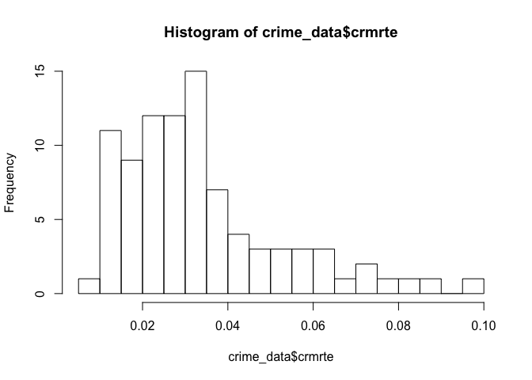<!-- -->

Looking at the histogram, the crimes committed per person have a curve
that skewed to
right.

## 4\. `prbarr` is the probability of arrest

### Look at the summary of the numeric variable, is there any negative values that weren’t supposed to be there?

``` r
summary(crime_data$prbarr)
```

    ##    Min. 1st Qu.  Median    Mean 3rd Qu.    Max. 
    ## 0.09277 0.20495 0.27146 0.29524 0.34487 1.09091

Why is the max value greater than
    1?

``` r
crime_data[crime_data$prbarr>1,]
```

    ##    county year    crmrte  prbarr prbconv prbpris avgsen      polpc
    ## 51    115 1987 0.0055332 1.09091     1.5     0.5   20.7 0.00905433
    ##      density   taxpc west central urban pctmin80     wcon     wtuc
    ## 51 0.3858093 28.1931    1       0     0  1.28365 204.2206 503.2351
    ##        wtrd     wfir     wser   wmfg  wfed   wsta   wloc mix    pctymle
    ## 51 217.4908 342.4658 245.2061 448.42 442.2 340.39 386.12 0.1 0.07253495

**Top coding** in this case. Since the probability should never exceeds
1 in theory, I will transform all the probability values that exceeds 1
into greater than 1.

``` r
crime_data[crime_data$prbarr > 1,'prbarr'] <- 1
hist(crime_data$prbarr, breaks = 30)
```

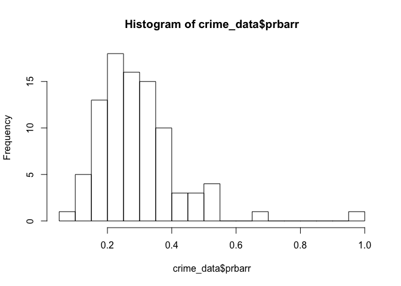<!-- -->

## 5\. `prbconv` is the probability of conviction

### Look at the summary of the numeric variable, is there any negative values that weren’t supposed to be there?

``` r
table(crime_data$prbconv)
```

    ## 
    ##                       ` 0.068376102 0.140350997 0.154451996 0.203724995 
    ##           0           0           1           1           1           1 
    ## 0.207830995    0.220339 0.226361006 0.229589999 0.248275995 0.259833008 
    ##           1           1           1           1           1           1 
    ## 0.267856985 0.271946996  0.28947401 0.300577998 0.308411002 0.314606994 
    ##           1           1           1           1           1           1 
    ## 0.322580993 0.325300992 0.327868998 0.328664005 0.334701002 0.340490997 
    ##           1           1           1           1           1           1 
    ## 0.343023002 0.347799987 0.352941006  0.36015299 0.364353001 0.371879011 
    ##           1           1           1           1           1           1 
    ##    0.381908 0.384236008 0.385495991 0.386925995 0.393413007    0.401198 
    ##           1           1           1           1           1           1 
    ## 0.403780013 0.406780005 0.410596013 0.412698001 0.426777989 0.436441004 
    ##           1           1           1           1           1           1 
    ## 0.438960999 0.443114012 0.443681002 0.449999988 0.450567007 0.452829987 
    ##           1           1           1           1           1           1 
    ## 0.457210004 0.459215999 0.468531013 0.476563007 0.477732986 0.492940009 
    ##           1           1           1           1           1           1 
    ## 0.493438005 0.495575011  0.50819701 0.515464008 0.520606995 0.520709991 
    ##           1           1           1           1           1           1 
    ## 0.522387981 0.525424004 0.527595997 0.528302014 0.548494995 0.549019992 
    ##           1           1           1           1           1           1 
    ## 0.559822977 0.571429014 0.573943973 0.588859022 0.589905024 0.595077991 
    ##           1           1           1           1           1           1 
    ##  0.62251699 0.722972989 0.736908972 0.739394009 0.763333023 0.769231021 
    ##           1           1           1           1           1           1 
    ## 0.781608999 0.793232977 0.909090996 0.972972989 1.015380025 1.068969965 
    ##           1           1           1           1           1           1 
    ## 1.182929993 1.225610018 1.234380007 1.358139992 1.481480002         1.5 
    ##           1           1           1           1           1           1 
    ## 1.670519948 2.121210098 
    ##           1           1

``` r
# looks like `prbconv` is coded as a factor, I will change it to numeric
crime_data$prbconv <- as.numeric(levels(crime_data$prbconv))[crime_data$prbconv]
```

    ## Warning: NAs introduced by coercion

``` r
# check on the NA values
sum(is.na(crime_data$prbconv))
```

    ## [1] 0

``` r
summary(crime_data$prbconv)
```

    ##    Min. 1st Qu.  Median    Mean 3rd Qu.    Max. 
    ## 0.06838 0.34422 0.45170 0.55086 0.58513 2.12121

Same as above, why there are values greater than 1? Again, code them as
1 for the same
reason

``` r
crime_data[crime_data$prbconv > 1, 'prbconv'] <- 1
```

``` r
hist(crime_data$prbconv, breaks = 30, main = '# of convictions/# of arrests')
```

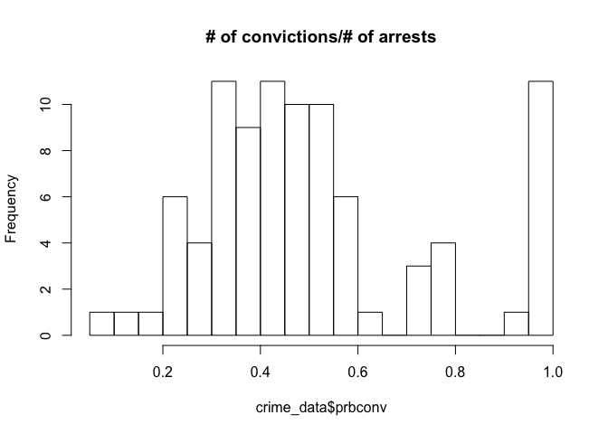<!-- -->

``` r
hist(crime_data$prbconv*crime_data$prbarr, breaks = 30, main = '# of convictions/# of offenses')
```

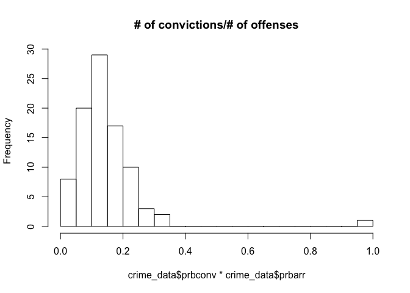<!-- -->

## 6\. `prbpris` is the probability of prison sentence

### Look at the summary of the numeric variable, is there any negative values that weren’t supposed to be there?

``` r
summary(crime_data$prbpris)
```

    ##    Min. 1st Qu.  Median    Mean 3rd Qu.    Max. 
    ##  0.1500  0.3642  0.4222  0.4106  0.4576  0.6000

``` r
hist(crime_data$prbpris, main = '# of convictions resulting in prison/# of convictions', breaks = 30)
```

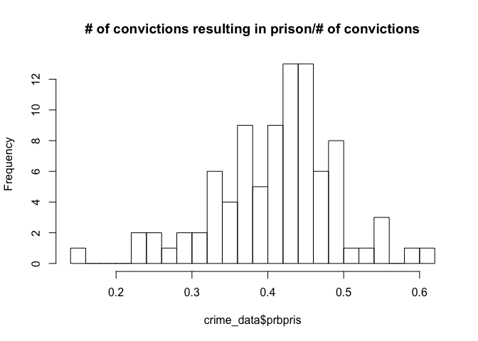<!-- -->

``` r
hist(crime_data$prbpris * crime_data$prbconv, main = '# of convictions resulting in prison/# of arrests', breaks = 30)
```

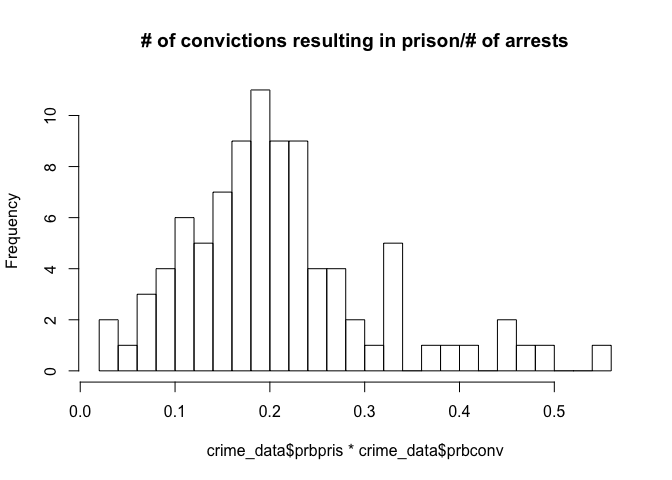<!-- -->

``` r
hist(crime_data$prbpris * crime_data$prbconv * crime_data$prbarr, main = '# of convictions resulting in prison/# of offenses', breaks = 30)
```

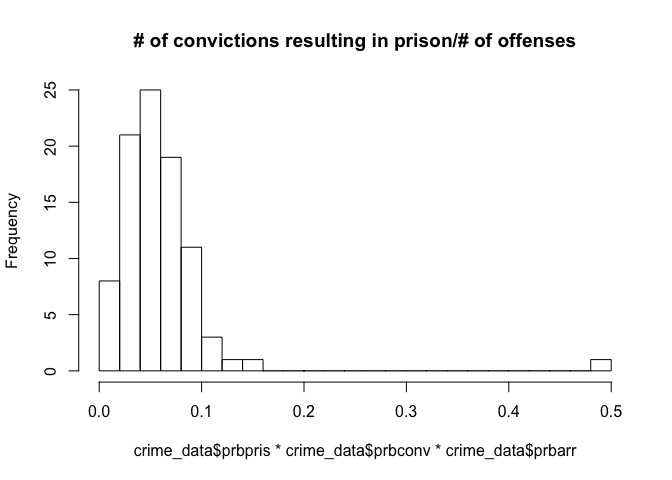<!-- --> The histogram
is very normally
distributed

## 7\. `avgsen` is the average sentence days

### Look at the summary of the numeric variable, is there any negative values that weren’t supposed to be there?

``` r
summary(crime_data$avgsen)
```

    ##    Min. 1st Qu.  Median    Mean 3rd Qu.    Max. 
    ##   5.380   7.375   9.110   9.689  11.465  20.700

``` r
hist(crime_data$avgsen)
```

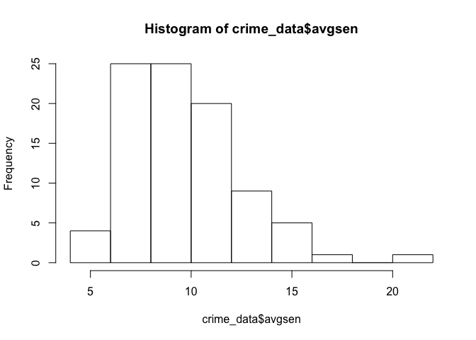<!-- --> The minimum
average sentence days ranging from 5 to 20
years

## 8\. `polpc` is police per capita

### Look at the summary of the numeric variable, is there any negative values that weren’t supposed to be there?

``` r
summary(crime_data$polpc)
```

    ##      Min.   1st Qu.    Median      Mean   3rd Qu.      Max. 
    ## 0.0007459 0.0012378 0.0014897 0.0017080 0.0018856 0.0090543

``` r
hist(crime_data$polpc, breaks = 30, main = 'Police per capita')
```

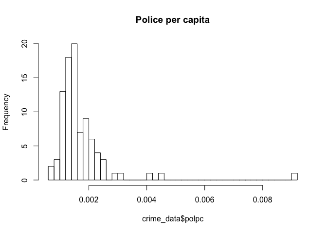<!-- -->

## 9\. `density` is people per sq mile

### Look at the summary of the numeric variable, is there any negative values that weren’t supposed to be there?

``` r
summary(crime_data$density)
```

    ##    Min. 1st Qu.  Median    Mean 3rd Qu.    Max. 
    ## 0.00002 0.54718 0.97925 1.43567 1.56926 8.82765

``` r
hist(crime_data$density, breaks = 30, main = 'People per sq mile by county')
```

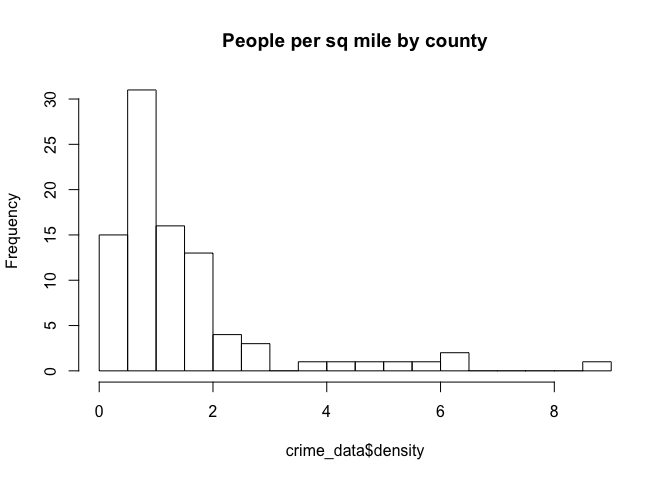<!-- -->

``` r
hist(crime_data$density * crime_data$polpc, breaks = 30, main = 'Police per sq mile by county')
```

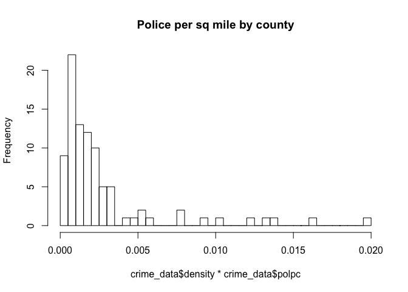<!-- -->

## 10\. `taxpc` is tax revenue per capita

### Look at the summary of the numeric variable, is there any negative values that weren’t supposed to be there?

``` r
summary(crime_data$taxpc)
```

    ##    Min. 1st Qu.  Median    Mean 3rd Qu.    Max. 
    ##   25.69   30.73   34.92   38.16   41.01  119.76

``` r
hist(crime_data$taxpc, breaks = 30, main = 'Tax Revenue per Capita')
```

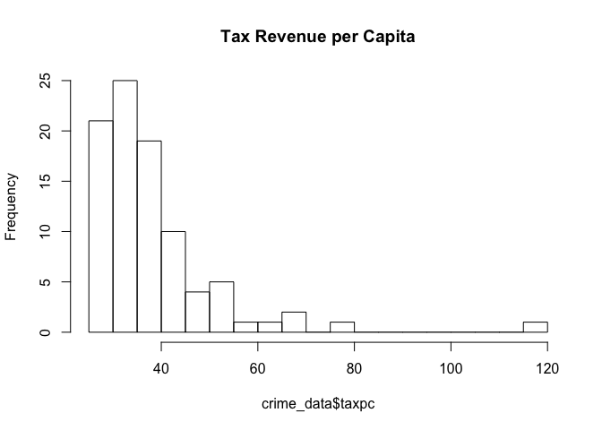<!-- -->

## 11, 12, 13. `west` =1 if in western N.C, `central` =1 if in central N.C, `urban` =1 if in SMSA

### Look at the if it’s mutually exclusive

``` r
table(crime_data$west + crime_data$central)
```

    ## 
    ##  0  1  2 
    ## 35 54  1

``` r
table(crime_data$urban)
```

    ## 
    ##  0  1 
    ## 82  8

There is one observation that has 1 for
    both

``` r
crime_data[crime_data$west + crime_data$central == 2, ]
```

    ##    county year    crmrte   prbarr prbconv  prbpris avgsen      polpc
    ## 33     71 1987 0.0544061 0.243119 0.22959 0.379175  11.29 0.00207028
    ##     density    taxpc west central urban pctmin80     wcon     wtuc
    ## 33 4.834734 31.53658    1       1     0   13.315 291.4508 595.3719
    ##        wtrd     wfir     wser   wmfg   wfed   wsta   wloc       mix
    ## 33 240.3673 348.0254 295.2301 358.95 509.43 359.11 339.58 0.1018608
    ##       pctymle
    ## 33 0.07939028

I will just leave it there. One sample shouldn’t have too much influence
on the overall sample
performance

## 14\. `pctmin80` is the percentage of minority in 1980

### Look at the summary of the numeric variable, is there any negative values that weren’t supposed to be there?

``` r
summary(crime_data$pctmin80)
```

    ##    Min. 1st Qu.  Median    Mean 3rd Qu.    Max. 
    ##   1.284  10.024  24.852  25.713  38.183  64.348

``` r
hist(crime_data$pctmin80, breaks = 30, main = 'Percentage of minority in 1980')
```

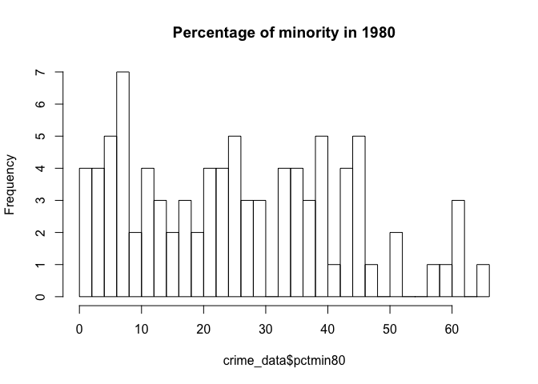<!-- -->

## 15-23. weekly wages

> `wcon` for construction, `wtuc` for
> transportation/utility/cummunication, `wtrd` for wholesale/retail,
> `wfir` for finance/investment/real estate, `wser` for service
> industry, `wmfg` for manufacturing, `wfed` for fed employees, `wsta`
> for state employees, `wloc` for local government
employees

### Look at the summary of the numeric variable, is there any negative values that weren’t supposed to be there?

``` r
summary(crime_data[c('wcon', 'wtuc', 'wtrd', 'wfir', 'wser', 'wmfg', 'wfed', 'wsta', 'wloc')])
```

    ##       wcon            wtuc            wtrd            wfir      
    ##  Min.   :193.6   Min.   :187.6   Min.   :154.2   Min.   :170.9  
    ##  1st Qu.:250.8   1st Qu.:374.3   1st Qu.:190.7   1st Qu.:285.6  
    ##  Median :281.2   Median :404.8   Median :203.0   Median :317.1  
    ##  Mean   :285.4   Mean   :410.9   Mean   :210.9   Mean   :321.6  
    ##  3rd Qu.:315.0   3rd Qu.:440.7   3rd Qu.:224.3   3rd Qu.:342.6  
    ##  Max.   :436.8   Max.   :613.2   Max.   :354.7   Max.   :509.5  
    ##       wser             wmfg            wfed            wsta      
    ##  Min.   : 133.0   Min.   :157.4   Min.   :326.1   Min.   :258.3  
    ##  1st Qu.: 229.3   1st Qu.:288.6   1st Qu.:398.8   1st Qu.:329.3  
    ##  Median : 253.1   Median :321.1   Median :448.9   Median :358.4  
    ##  Mean   : 275.3   Mean   :336.0   Mean   :442.6   Mean   :357.7  
    ##  3rd Qu.: 277.6   3rd Qu.:359.9   3rd Qu.:478.3   3rd Qu.:383.2  
    ##  Max.   :2177.1   Max.   :646.9   Max.   :598.0   Max.   :499.6  
    ##       wloc      
    ##  Min.   :239.2  
    ##  1st Qu.:297.2  
    ##  Median :307.6  
    ##  Mean   :312.3  
    ##  3rd Qu.:328.8  
    ##  Max.   :388.1

``` r
row_means <- apply(X=crime_data[c('wcon', 'wtuc', 'wtrd', 'wfir', 'wser', 'wmfg', 'wfed', 'wsta', 'wloc')], MARGIN=1, FUN=mean, na.rm=TRUE)
summary(row_means)
```

    ##    Min. 1st Qu.  Median    Mean 3rd Qu.    Max. 
    ##   259.8   302.3   322.9   328.1   345.2   496.0

``` r
hist(row_means, breaks = 30, main = 'Average Weekly Wages across all files')
```

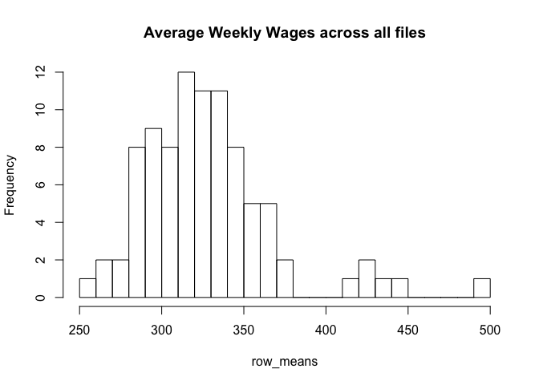<!-- --> Here I noticed
that `wser` has a maximum value of 2177.1, which is obviously an
outlier, and seems to be recorded
    incorrectly.

``` r
crime_data[crime_data$wser>2000, ]
```

    ##    county year    crmrte   prbarr prbconv  prbpris avgsen     polpc
    ## 84    185 1987 0.0108703 0.195266       1 0.442857   5.38 0.0012221
    ##      density    taxpc west central urban pctmin80     wcon    wtuc
    ## 84 0.3887588 40.82454    0       1     0  64.3482 226.8245 331.565
    ##        wtrd     wfir     wser   wmfg   wfed   wsta   wloc        mix
    ## 84 167.3726 264.4231 2177.068 247.72 381.33 367.25 300.13 0.04968944
    ##       pctymle
    ## 84 0.07008217

It’s safe to assume that, based on all other values, this value is
supposed to be 217.7068 instead of 2177.068 so that it falls into the
proper range of average weekly
wage.

``` r
crime_data[crime_data$wser>2000, 'wser'] <- crime_data[crime_data$wser>2000, 'wser'] / 10
summary(crime_data$wser)
```

    ##    Min. 1st Qu.  Median    Mean 3rd Qu.    Max. 
    ##   133.0   225.1   252.2   253.6   275.9   391.3

#### create a new column containing the average wage across all sectors

``` r
crime_data['avg_wage'] <- row_means
```

## 24\. `mix` is offese mix: face-to-face/other

### Look at the summary of the numeric variable, is there any negative values that weren’t supposed to be there?

``` r
summary(crime_data$mix)
```

    ##    Min. 1st Qu.  Median    Mean 3rd Qu.    Max. 
    ## 0.01961 0.08060 0.10095 0.12905 0.15206 0.46512

``` r
hist(crime_data$mix, main = 'Ratio of face-to-face offense vs other')
```

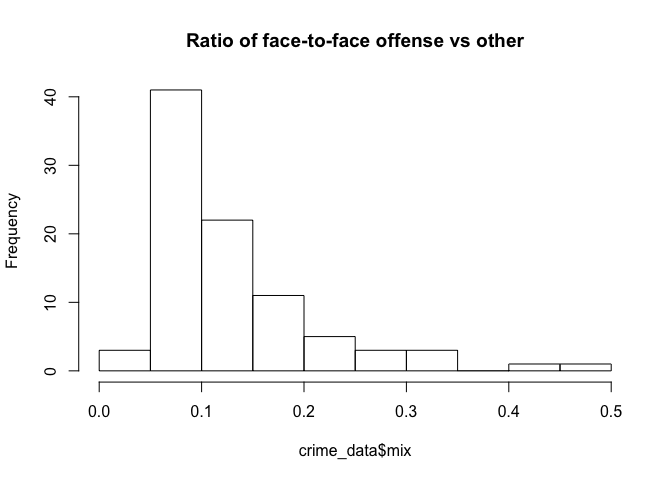<!-- -->

## 25\. `pctymle` is percent young male

### Look at the summary of the numeric variable, is there any negative values that weren’t supposed to be there?

``` r
summary(crime_data$pctymle)
```

    ##    Min. 1st Qu.  Median    Mean 3rd Qu.    Max. 
    ## 0.06216 0.07437 0.07770 0.08403 0.08352 0.24871

``` r
hist(crime_data$pctymle, breaks = 30, main = 'percentage of young male')
```

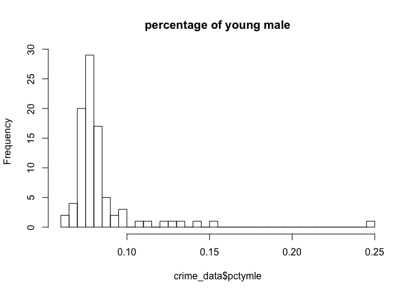<!-- -->

# \# Variable transformation

Here, I’m adding 2 new variables: `pr_punishment` and
`pr_conviction_over_offenses`, where \* `pr_punishment` represents the
probability that offenses end up being sentenced to prison, or the ratio
of convictions resulting in a prison sentence to offenses. \*
`pr_conviction_over_offenses` represents the probability that offenses
end up being convictions, or the ratio of convictions to
offenses.

``` r
crime_data['pr_punishment'] <- crime_data['prbarr'] * crime_data['prbconv'] *crime_data['prbpris']
crime_data['pr_conviction_over_offenses'] <- crime_data['prbarr'] * crime_data['prbconv']
```

``` r
# renaming the variable names
colnames(crime_data) <- c('county_id', 'year', 'crime_rate', 'pr_arrest', 'pr_conviction', 'pr_sentence', 'avg_sentence', 
                          'police_per_capita','population_density', 'tax_per_capita', 'is_west', 'is_central', 'is_urban', 
                          'pct_minority','w_construction', 'w_tuc', 'w_sales', 'w_fin', 'w_service', 'w_manu', 'w_fed', 'w_state', 
                          'w_local_gov', 'offense_mix', 'pct_young_male','avg_wage', 'pr_punishment', 'pr_conviction_over_offenses')
```

# \# Correlation Plot

``` r
crime_cols <- crime_data[c('crime_rate', 'pr_arrest', 'pr_conviction', 'pr_sentence', 'pr_punishment', 'pr_conviction_over_offenses',
                           'avg_sentence', 'police_per_capita',
                           'population_density', 'tax_per_capita', 'is_west', 'is_central', 'is_urban', 'pct_minority',
                           'w_construction', 'w_tuc', 'w_sales', 'w_fin', 'w_service', 'w_manu', 'w_fed', 'w_state', 'w_local_gov', 
                           'offense_mix', 'pct_young_male', 'avg_wage')]

crime_cols_cor = cor(crime_cols)
corrplot(crime_cols_cor, type = "upper", tl.col = "black", tl.srt = 45, tl.cex = 0.7)
```

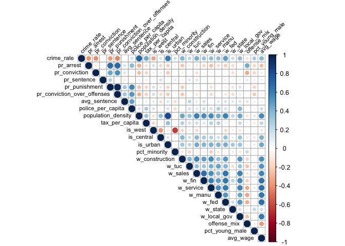<!-- -->
