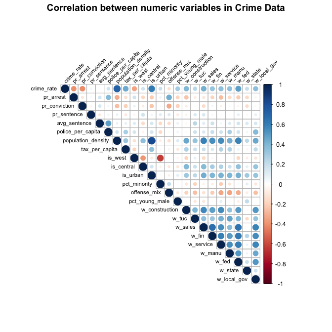
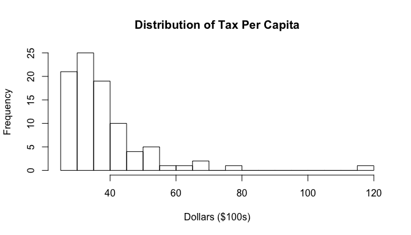
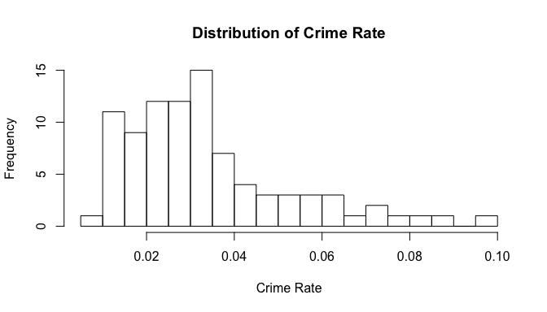
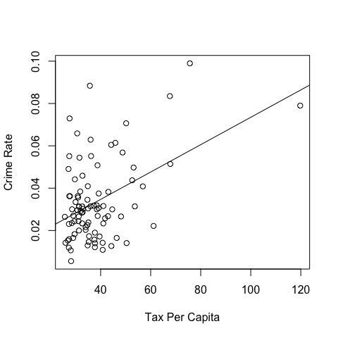
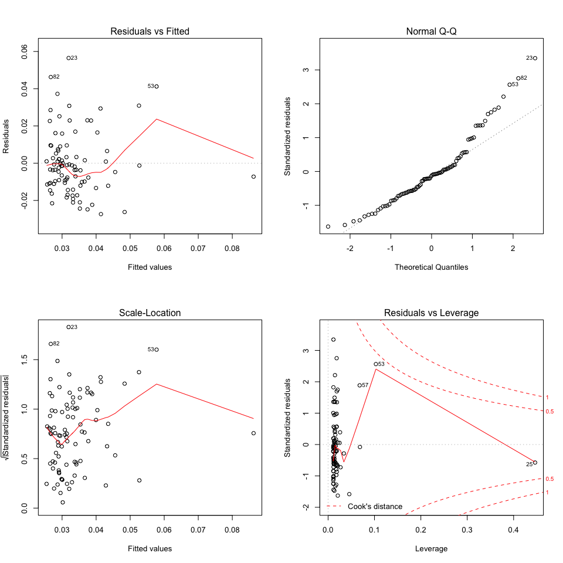
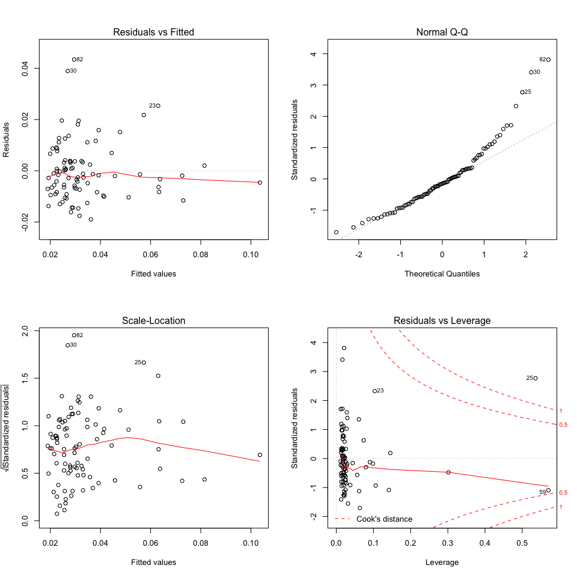
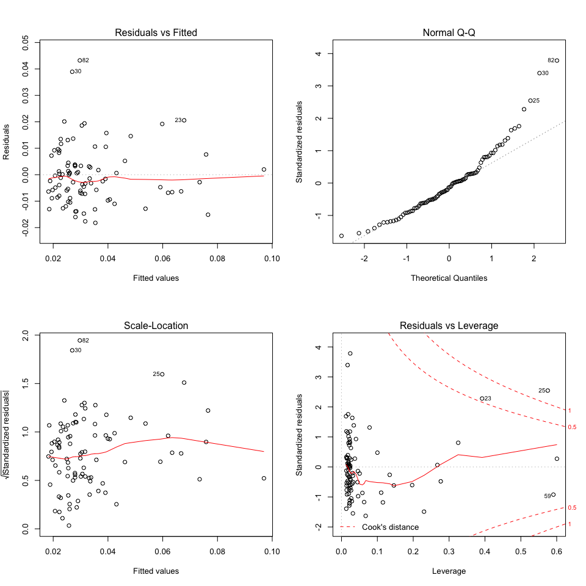
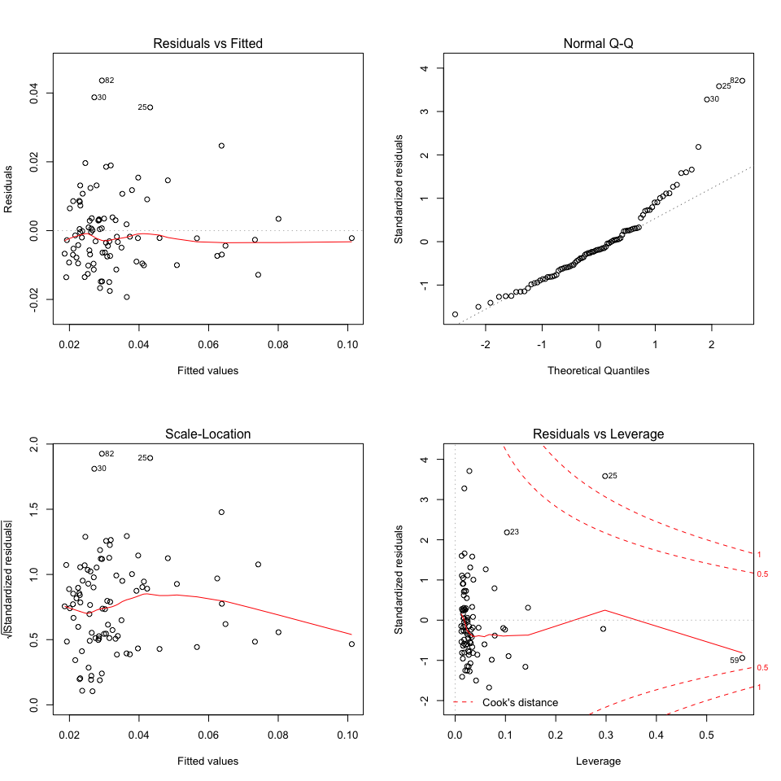

Lab 3 Reducing Crime
================
Team 5
11/16/2019

# 1.0 Introduction

Crime represents one of the major scourges that our societies continue
to try and mitigate. The entire study of criminology is dedicated to the
understanding and prevention of crime in communities. While the causes
of crime are multifaceted and complex, we hypothesize that income
inequality stands as one of the more significant factors, e.g. as wealth
disparity increases, individuals on the lower end of the income spectrum
resort to crime due to economic desperation. In this report, we analyze
data on crime and demographics in North Carolina to determine if a
positive causal relationship exists between income inequality and crime
rate in our dataset. We believe these findings will be of use for local
governments in generating economic policy reform.

# 2.0 Data Cleansing

Data is drawn from data sources provided by the campaign.

``` r
raw_data <- read.csv('../data/raw/crime_v2.csv')
```

After sanity checks, we noticed a few anomalous values that are likely
to be entering errors. We made the following major changes in order to
proceed with a cleaned-up dataset.

1.  Remove 6 NA values as they do not lend any values to the analysis.
2.  Remove one of the duplicated values for County 193.
3.  Top coding all the probability variable with the max value = 1, as
    any probability greater than 1 does not make sense.
4.  For one particular variable `wser`, there is one value that seems to
    be mis-entered by one digit, changing it from 217.71 to 2177.07. In
    light of other wage values, we change this back to 217.71.

We’ve also renamed the variables for better understanding. For more
details about how the data has been changed, see
`./src/make_features.R`. The processed data is stored as
`./data/processed/crime_v2.csv`.And, for supporting information that
verifies the distributions of data, please see the EDA file in
`./notebooks/EDA.md`.

``` r
crime_data <- read.csv('../data/processed/crime_v2.csv')
```

After cleansing, the data set now has 90 observations.

# 3.0 EDA

## Correlation Plot

We produce a correlation plot to help visualize the relationships
between all the variables.

``` r
crime_cols_cor <- cor(crime_data[c('crime_rate', 'pr_arrest',
                                   'pr_conviction', 'pr_sentence',
                                   'avg_sentence', 'police_per_capita',
                                   'population_density', 'tax_per_capita',
                                   'is_west', 'is_central', 'is_urban',
                                   'pct_minority', 'offense_mix', 'pct_young_male',
                                   'w_construction', 'w_tuc', 'w_sales', 'w_fin',
                                   'w_service', 'w_manu', 'w_fed',
                                   'w_state', 'w_local_gov')])

corrplot(
  crime_cols_cor,
  type = "upper",
  tl.col = "black",
  tl.srt = 45,
  tl.cex = 0.7,
  mar = c(1, 1, 1.5, 1),
  title = 'Correlation between numeric variables in Crime Data'
  )
```

<!-- -->

In analyzing the correlation plot, we distinguish between our variables
that likely have a causal impact on crime rate and those that are
causally impacted by crime rate. We identify some variables that show a
correlation to crime rate, such as `population_density`,
`tax_per_capita`, and `pct_young_male`, as causally related to the
variable `crime_rate`. On the other hand, for variables related to
criminal justice- `pr_arrest`, `pr_conviction`, `pr_sentencing`,
`avg_sentence` and `police_per_capita`, while these variables are also
highly correlated with crime rate, we are not confident to derive the
direction of causality for them. There could be a two-way relationship
where high crime rate leads to more police per capita, more arrests or
higher conviction rates. When constructing our initial model, we think
about the goal of this analysis, which is to provide policy
recommendations to the local government. From the policy-making
standpoint, we decide to focus on looking for causal relationships that
lead to actionable recommendations to local government.

In regards to the wage variables, we view these variables as too closely
interwoven with our explanatory variable, `tax_per_capita`, to be
included in our model. Increased wages are directly tied to increased
taxes. Additionally, because these variables have no indication of scale
e.g. no reference is made to how many individuals in each industry are
earning the specified wages, it is difficult to derive value from these
variables for policy recommendations.

### Key Explanatory Variables

As our data does not have a variable that directly measures income
inequality, we attempt to find a closely correlated variable that can
serve as a proxy in our regression. Household income in American
communities generally follows a positively skewed distribution, with a
small percentage of households earning huge incomes relative to the
median. It follows that in more unequal communities, more households
would reside on the extreme right end of this positive skew, increasing
the variance of incomes in the community. Thus, in these unequal
communities we would expect to see greater average wealth per household
and consequentially, a greater amount of tax being paid on that wealth.

Following this logic, we use the variable `tax_per_capita` as a proxy
for income inequality. As these counties are all in the same state, our
metrics will not be skewed by different state tax policies across our
data.

First, we take a look at the distribution of `tax_per_capita`:

``` r
hist(
  crime_data$tax_per_capita,
  breaks = 30,
  main = 'Distribution of Tax Per Capita',
  xlab = 'Dollars ($100s)'
  )
```



Based on background research of 1980’s tax levels, it appears the
`tax_per_capita` variable is diplayed in hundreds of dollars e.g. $35
indicates $3,500. In discussing the practical significance of our
models, we will convert this variable in terms of real dollars.

We note from the chart that there is a strong positive skew and an
outlier that is $1.197615^{4}. While this outlier will likely have large
leverage in our data, we choose to include it as the data appears to be
valid and we see no reason not to include it.

### Outcome Variable: Crime Rate

Now let’s take a look at the outcome variable, or the dependent
variable, crime rate.

``` r
hist(
  crime_data$crime_rate,
  breaks = 30,
  main = 'Distribution of Crime Rate',
  xlab = 'Crime Rate'
  )
```



We note from the plot that there is a strong positive skew in crime
rate, meaning that there are a few counties have higher crime rate than
the rest. From the policy implementation standpoint, these counties
should be considered as priority of reduce crime rate.

### Correlation between Crime rate and Tax per Capita

``` r
plot(
  crime_data$tax_per_capita, crime_data$crime_rate,
  xlab="Tax Per Capita",
  ylab="Crime Rate"
  )  

abline(lm(crime_data$crime_rate ~ crime_data$tax_per_capita))
```



The plot above tells us that there’s a positive correlation between `Tax
Per Capita` and `Crime Rate`, despite a few outliers. With this
correlation scatter plot, we proceed with using `Tax Per Capita` as our
main explanatory variable to build the following models.

# 4.0 Model Building

#### Model 1: A model with only explanatory variables of key interest

Based on our hypothesis, we estimate a simple linear regression,
explaining `crime_rate` with `tax_per_capita`.

``` r
model1 <- lm(crime_rate ~ tax_per_capita, data=crime_data)
```

Now we want to examine the CLM assumptions for this model by plotting
the 4 diagnostic plots -

``` r
par(mfrow=c(2,2))
plot(model1)
```



  - The *Residual vs Fitted plot* on the upper left shows that the
    residules have a non-linear patterns, which means that it appears to
    violate the zero conditional mean assumption.
  - The *Q-Q plot* on the upper right shows if residuals are normally
    distributed. In this case, the residuals do not follow the straight
    line well, meaning that it appears to violates the normality of
    errors. Also, the p\_value from a Shapiro-Wilk test is
    1.719189^{-4}, which indicates that we should reject the null
    hypothesis that these residuals are drawn from a population with a
    normal distribution.
  - The *Scale-Location plot* on the lower left shows if residuals are
    spread equally along the range of predictors. Since the points are
    not tracking the same level from left to right as a horizontal line,
    there does not seem to be a constant variance of the error term.
    This is a strong indication of heteroskedasticity.
  - The *Residuals vs leverage plot* is used to identify points that are
    outliers and have a lot of influence. In this case, althought some
    points are approaching a Cook’s distance of 0.5, they are not in the
    range that we would consider high influence (generally around Cook’s
    distance of 1).

Based on the diagnostic plots, we evaluate our 6 assumptions for the
Classic Linear Model (CLM):

1.  Linear model:

<!-- end list -->

  - This assumption is met inherently due to how we have fit our model.

<!-- end list -->

2.  Data is a random sample drawn from the population:

<!-- end list -->

  - This assumption is broken due to the nature of the sampling. Each
    observation in the sample is a county in North Carolina. As the only
    major distinguishing factor between counties is geographic lines, it
    is highly likely that neighboring counties share many of the same
    characteristics. Due to this correlation between counties, our
    sample is clustered and we are not gaining as much unique
    information from our data as we would from a truly random sample.
    Despite this, due to our large sample size, we believe we can keep
    this information in mind and proceed with our modeling.

<!-- end list -->

3.  No perfect multicollinearity:

<!-- end list -->

  - Based on EDA, there is no perfect multicollinearity in our data.

<!-- end list -->

4.  Zero Conditional Mean:

<!-- end list -->

  - Based on the residuals vs fitted plot, zero conditional mean is
    violated. To address this we will include more covariates in later
    models.

<!-- end list -->

5.  Homoskedasticity:

<!-- end list -->

  - The regression displays heteroskedasticity, seen in the residuals vs
    fitted plot and scale-location plot. To address this, we will use
    robust standard errors to evaluate model 1 and will include more
    covariates in future models.

<!-- end list -->

6.  Normality of error terms:

<!-- end list -->

  - Normality of error terms is violated. Because we have a large
    sample, we can rely on OLS asymptotics. We also get normality of our
    sampling distributions from the large sample size(n\>30).

<!-- end list -->

``` r
se.model1 <- coeftest(model1, vcov = vcovHC)[ , "Std. Error"]

stargazer(
  model1,  
  title = 'Model 1: Base Model',
  type = "text",
  omit.stat = "f",
  se = list(se.model1),
  star.cutoffs = c(0.05, 0.01, 0.001),
  digits = 5
  )
```

    ## 
    ## Model 1: Base Model
    ## =================================================
    ##                          Dependent variable:     
    ##                     -----------------------------
    ##                              crime_rate          
    ## -------------------------------------------------
    ## tax_per_capita               0.00065***          
    ##                               (0.00017)          
    ##                                                  
    ## Constant                       0.00884           
    ##                               (0.00631)          
    ##                                                  
    ## -------------------------------------------------
    ## Observations                     90              
    ## R2                             0.20135           
    ## Adjusted R2                    0.19227           
    ## Residual Std. Error       0.01697 (df = 88)      
    ## =================================================
    ## Note:               *p<0.05; **p<0.01; ***p<0.001

As you can see in Table 1, reported above, `tax_per_capita` has a
positive coefficient, meaning that if we increase `tax_per_capita` by
$1,000 (in real $ terms), our model predicts the crime rate will
increase by 0.0065. To give some reference to these values, a $1000
change in `tax_per_capita` represents 0.76 of the standard deviation for
`tax_per_capita`, while 0.0065 represents 0.34 of the standard deviation
of `crime_rate`.

This offers initial support for our hypothesis that income inequality is
a factor in crime rate, however we will need to add additional variables
to come to any conclusions.

#### Model 2: A model that includes key explanatory variables and important covariates

Now, we want to include some covariates that will increase the accuracy
of the results without introducing substantial bias. The key covariates
to include in our model are `population_density` and `pct_young_male`,
as they are highly correlated to our dependent variable and also
correlated to our independent explanatory variable, `tax_per_capita`.

`population_density` is positively correlated with `tax_per_capita` and
`crime_rate`, as more densely populated areas are associated both with
higher earnings (more taxes paid) and greater rates of crime. We predict
that omitting it has exerted a positive bias and adding it to our model
will bring our key explanatory variable closer to 0, potentially with a
substantial impact. `pct_young_male` is negatively correlated with
`tax_per_capita`, but positively correlated with `crime_rate`. This is
also intuitive, as this younger demographic is not likely to be higher
earners and are also a group associated with higher rates of crime.
Omitting this variable has exerted a negative bias and adding it to our
model will bring our key explanatory variable further from 0, although
the impact is likely small based on the small correlation it has to
`tax_per_capita`.

``` r
model2 <- lm(crime_rate ~ tax_per_capita + population_density + pct_young_male,
             data=crime_data)
```

Now we want to examine the CLM assumptions for this model by plotting
the 4 diagnostic plots:

``` r
par(mfrow=c(2,2))
plot(model2)
```



  - The *Residual vs Fitted plot* on the upper left shows that the
    residules have only a slight non-linear patterns and support zero
    conditional mean much more than in model 1.
  - The *Q-Q plot* on the upper right shows if residuals are normally
    distributed. In this case, the residuals do not follow the straight
    line well, meaning that it appears to violates the normality of
    errors. Also, the p\_value from a Shapiro-Wilk test is
    4.1491195^{-5}, which indicates that we should reject the null
    hypothesis that theseresiduals are drawn from a population with a
    normal distribution.
  - The *Scale-Location plot* on the lower left shows if residuals are
    spread equally along the range of predictors. This line is much
    flatter than the one from model 1, even though it’s slightly
    affected by larger values (potentially outliers). Due to the lack of
    data points for larger fitted values, the levels of variance are
    much more random in this range. Further support for homoskedasticity
    is seen in the Residual vs Fitted plot, where the data does not
    appear to demonstrate any discernable change in variance as fitted
    values change. We will move ahead cautiously with non-robust
    standard errors.
  - The *Residuals vs Leverage plot* is used to identify points that are
    outliers and have a lot of influence. In this case, we do see a
    point that is above a Cook’s distance of 1 and appears to be
    exerting a large amount of influence on our model. This is the
    outlier we identified before and we will continue to include it in
    our model.

Based on the diagonstics, we think that model 2 is better than model 1
when examining the assumptions. The only CLM assumptions we identify as
violated are Random Sampling and Normality of Error Terms (both
discussed in model 1).

``` r
stargazer(
  model1, model2,
  title = 'Model 1 vs 2: Important covariates',
  type = "text",
  omit.stat = "f",
  se = list(se.model1),
  star.cutoffs = c(0.05, 0.01, 0.001)
  )
```

    ## 
    ## Model 1 vs 2: Important covariates
    ## ===================================================
    ##                           Dependent variable:      
    ##                     -------------------------------
    ##                               crime_rate           
    ##                           (1)             (2)      
    ## ---------------------------------------------------
    ## tax_per_capita         0.001***        0.0004***   
    ##                        (0.0002)        (0.0001)    
    ##                                                    
    ## population_density                     0.008***    
    ##                                         (0.001)    
    ##                                                    
    ## pct_young_male                         0.197***    
    ##                                         (0.053)    
    ##                                                    
    ## Constant                 0.009          -0.009     
    ##                         (0.006)         (0.006)    
    ##                                                    
    ## ---------------------------------------------------
    ## Observations              90              90       
    ## R2                       0.201           0.640     
    ## Adjusted R2              0.192           0.628     
    ## Residual Std. Error 0.017 (df = 88) 0.012 (df = 86)
    ## ===================================================
    ## Note:                 *p<0.05; **p<0.01; ***p<0.001

Population density and percentage of young male indeed reflect a
positive coefficients in our model, not surprising given the large
positive correlation we witnessed to crime rate in our EDA.

The coefficient of `tax_per_capita` in this model means that if we
increase the tax\_per\_capita by $1000 (while holding population density
and the percent of young males in the population constant), the
predicted crime rate will increase by 0.004. We expect this coefficient
in model 2 to be less than the coefficient in model 1 because of the
large positive effect that omitting `population_density` imposed on
`tax_per_capita` (compared with the relatively small effect imposed by
omitting `pct_young_male`). To give reference to the coefficient in
model 2, a 0.004 change represents 0.21 of the standard deviation of
`crime_rate`.

The AIC between model 1 and model 2 below also indicates that model
2(AIC=-542.12) is a better fit than model 1(AIC=-474.3), as a lower AIC
represents a better fit.

#### Model 3: Models with interaction terms

In our third model, we account for the difference between urban and
non-urban populations through the use of an interaction term. Due to the
distinct nature of the urban environment, we believe it is important to
model the effect that income inquality has on crime rate seperately in
these counties vs non-urban counties.

``` r
model3 <- lm(crime_rate ~ tax_per_capita * is_urban + population_density + pct_young_male,
             data=crime_data)
```

``` r
par(mfrow=c(2,2))
plot(model3)
```



The diagnostic plots for model 3 are similiar to model 2. Again, it
appears the only assumptions violated are Random Sampling and Normality
of Error Terms (both discussed in model 1).

``` r
stargazer(
  model1, model2, model3,
  title = 'Model 1 vs 2 vs 3: Improving accuracy with interaction terms',
  type = "text",
  omit.stat = "f",
  se = list(se.model1),
  star.cutoffs = c(0.05, 0.01, 0.001)
  )
```

    ## 
    ## Model 1 vs 2 vs 3: Improving accuracy with interaction terms
    ## =======================================================================
    ##                                       Dependent variable:              
    ##                         -----------------------------------------------
    ##                                           crime_rate                   
    ##                               (1)             (2)             (3)      
    ## -----------------------------------------------------------------------
    ## tax_per_capita             0.001***        0.0004***       0.0004***   
    ##                            (0.0002)        (0.0001)        (0.0001)    
    ##                                                                        
    ## is_urban                                                     0.019     
    ##                                                             (0.019)    
    ##                                                                        
    ## population_density                         0.008***        0.009***    
    ##                                             (0.001)         (0.002)    
    ##                                                                        
    ## pct_young_male                             0.197***        0.187***    
    ##                                             (0.053)         (0.054)    
    ##                                                                        
    ## tax_per_capita:is_urban                                     -0.0004    
    ##                                                            (0.0004)    
    ##                                                                        
    ## Constant                     0.009          -0.009          -0.010     
    ##                             (0.006)         (0.006)         (0.006)    
    ##                                                                        
    ## -----------------------------------------------------------------------
    ## Observations                  90              90              90       
    ## R2                           0.201           0.640           0.646     
    ## Adjusted R2                  0.192           0.628           0.625     
    ## Residual Std. Error     0.017 (df = 88) 0.012 (df = 86) 0.012 (df = 84)
    ## =======================================================================
    ## Note:                                     *p<0.05; **p<0.01; ***p<0.001

In model 3, we do not see the interaction term `tax_per_capita *
is_urban` as statistically significant. The practical meaning of this is
that there is no difference in the effect of tax per capita between
urban counties and non-urban counties. However, we can **only** conclude
this from the current data we have, which only contains 8 urban
counties. The insignificance in the coefficient here may just be the
small sample size from urban counties. Given the data we have, we decide
to drop this interaction term in the following model.

#### Model 4: Models with logarithm transformation

In our fourth model, we were trying to better interpret the coefficient
using a logarithm transformation. Similar to wage data, `tax_per_capita`
is a variable more easily interpreted by relative change in percentage
than absolute change in dollar amount.

``` r
model4 <- lm(crime_rate ~ log(tax_per_capita) + population_density + pct_young_male,
             data=crime_data)
```

Now we want to examine the CLM assumptions for this model by plotting
the 4 diagnostic plots:

``` r
par(mfrow=c(2,2))
plot(model4)
```



  - The *Residual vs Fitted plot* on the upper left shows that the
    residules have a linear pattern.
  - The *Q-Q plot* on the upper right shows that residuals do not follow
    the straight line well when it comes to larger quantiles, meaning
    that it appears to violates the normality of errors. Also, the
    p\_value from a Shapiro-Wilk test is 7.7649482^{-6}, which indicates
    that we should reject the null hypothesis that theseresiduals are
    drawn from a population with a normal distribution.
  - The *Scale-Location plot* on the lower left shows residuals are
    spread equally along the ranges of predictors. As with model 2, we
    see a slight pattern towards decreased variance in the upper range
    of our fitted values. We can assume this is likely due to scarcity
    of data points in this range. This is re-inforced by the Residuals
    vs Fitted plot, in which the variance of residuals appears to remain
    relatively constant with the exception of the upper range of fitted
    values where data points are scarce. We will proceed cautiously with
    non-robust standard errors.
  - The *Residuals vs leverage plot* is used to identify points that are
    outliers and have a lot of influence. We again see the presence of
    high influence observation 25.

Based on the diagonstics, we think that model 4 is better than model 2
when examing the assumptions.

``` r
stargazer(
  model1, model2, model4,
  title = 'Model 1 vs 2 vs 4: Improving accuracy with log transformation',
  type = "text",
  omit.stat = "f",
  se = list(se.model1),
  star.cutoffs = c(0.05, 0.01, 0.001)
  )
```

    ## 
    ## Model 1 vs 2 vs 4: Improving accuracy with log transformation
    ## ===================================================================
    ##                                   Dependent variable:              
    ##                     -----------------------------------------------
    ##                                       crime_rate                   
    ##                           (1)             (2)             (3)      
    ## -------------------------------------------------------------------
    ## tax_per_capita         0.001***        0.0004***                   
    ##                        (0.0002)        (0.0001)                    
    ##                                                                    
    ## log(tax_per_capita)                                     0.016**    
    ##                                                         (0.005)    
    ##                                                                    
    ## population_density                     0.008***        0.008***    
    ##                                         (0.001)         (0.001)    
    ##                                                                    
    ## pct_young_male                         0.197***        0.193***    
    ##                                         (0.053)         (0.055)    
    ##                                                                    
    ## Constant                 0.009          -0.009          -0.050*    
    ##                         (0.006)         (0.006)         (0.019)    
    ##                                                                    
    ## -------------------------------------------------------------------
    ## Observations              90              90              90       
    ## R2                       0.201           0.640           0.614     
    ## Adjusted R2              0.192           0.628           0.601     
    ## Residual Std. Error 0.017 (df = 88) 0.012 (df = 86) 0.012 (df = 86)
    ## ===================================================================
    ## Note:                                 *p<0.05; **p<0.01; ***p<0.001

In model 4, the coefficients of `log(tax_per_capita)` means that if we
increase the tax per capita by 10%, the mean crime rate is predicted to
increase by 0.0016, while holding other covariates constant. To give
reference to the coefficient in model 4, a 0.0016 change represents
0.0822 of the standard deviation of `crime_rate`.

It should be noted that while the decision was made to use non-robust
standard errors in the model above due to the presence of adequete
homoskedasticity, it is worth testing if our model maintains
significance using robust standard errors as well. Below we compare
model 4 using robust standard errors and non-robust standard errors.

``` r
se.model4 <- coeftest(model4, vcov = vcovHC)[ , "Std. Error"]

stargazer(
  model4, model4,
  title = "Model 4: Robust SE's vs Non-Robust SE's",
  type = "text",
  omit.stat = "f",
  se = list(se.model4),
  star.cutoffs = c(0.05, 0.01, 0.001)
  )
```

    ## 
    ## Model 4: Robust SE's vs Non-Robust SE's
    ## ============================================================
    ##                                    Dependent variable:      
    ##                               ------------------------------
    ##                                         crime_rate          
    ##                                     (1)            (2)      
    ## ------------------------------------------------------------
    ## log(tax_per_capita)                0.016         0.016**    
    ##                                   (0.013)        (0.005)    
    ##                                                             
    ## population_density               0.008***        0.008***   
    ##                                   (0.001)        (0.001)    
    ##                                                             
    ## pct_young_male                    0.193*         0.193***   
    ##                                   (0.076)        (0.055)    
    ##                                                             
    ## Constant                          -0.050         -0.050*    
    ##                                   (0.045)        (0.019)    
    ##                                                             
    ## ------------------------------------------------------------
    ## Observations                        90              90      
    ## R2                                 0.614          0.614     
    ## Adjusted R2                        0.601          0.601     
    ## Residual Std. Error (df = 86)      0.012          0.012     
    ## ============================================================
    ## Note:                          *p<0.05; **p<0.01; ***p<0.001

With a t-score of 1.239, `log(tax_per_capita)` has a p-value of .22 in
the context of our robust standard error model. Thus,
`log(tax_per_capita)`, does not maintain statistical significance when
subjected to robust standard errors. This is an important caveat and
must be noted in our conclusions.

# 5.0 Omitted Variables

Our objective is to research how change in tax per capita affects crime
rate and use this reserach to provide policy recommendations for local
government. We already have data for some of the variables that affect
crime rate. However, we do not have data for many of the other important
variables that affect crime rate. Below we analyze the effect of some of
the omitted variables on crime rate and tax per capita.

To determine the omitted variables we first researched factors that
fundamentally cause people to commit crime. We believe people commit
crime due to many reasons, including income inequality, unemployment,
poverty, education levels, drug abuse, emotional well being,
homelessness, hunger, broken families, unwanted pregnancies and youth
hormones.

We then distilled the above factors into variables that are observable
and measurable.

  - Unemployment - Unemployment Rate

  - Education - Number of People unable to read and write

  - Alcohol and Drug Abuse - Amount of alcohol or opioid consumption

  - Emotional Wellness - Number of unwanted pregnancies

  - Poverty Rate - % of population living below poverty level

  - Homelessness - Number of families without home or shelter

  - Hunger - Number of families having 1-2 meals per day

  - Broken Families - Number of children in orphanage

  - Hormones

We then analyzed the following most important omitted variables:

  - Education level - Negative to crime rate, positive to tax per
    capita; well-educated population tend to have higher income thus pay
    more in taxes and commit less crime. Omitting education level
    creates a negative bias, and it could be a fairly large bias
    considering the importance of education.

  - Alcohol and Drug abuse - Positive to crime rate, negative to tax per
    capita; alcohol and drug abuse leads to less income which leads to
    less tax per capita, and it leads to more crimes. Omitting the
    alcohol and drug abuse level creates a negative bias.

  - Unemployment Rate - Positive to crime rate, negative to tax per
    capita; the higher the unemployment rate, the lower average income
    becomes and lower the tax per capita, and unemployment can lead to
    committing crimes in order to make a living. Omitting the
    unemployment rate creates a negative bias.

  - Homelessness rate - positive to crime rate, negative to tax per
    capita; same as unemployment rate, homelessness rate has a two way
    effect towards high unemployment rate. Similarly, omitting the
    homelessnes rate pose a negative bias.

  - Amount of local businesses/job opportunities - Negative to crime
    rate, positive to tax per capita; the more local businesses/job
    opportunities are, the lower unemployment rate will be, and hence
    lower crimer rate and higher tax per capita. Omitting the
    vibrantness of local business can create a negative bias.

Thus, all the most important omitted variables create a negative bias.
Based on the positive coefficient we have seen in our models for
`tax_per_capita`, the effect of these negatives biases on the
coefficient is towards zero. This would indicate that we are
underestimating the true population value for the coefficient of
`tax_per_capita`.

# 6.0 Conclusions

Our analysis indicates that `tax_per_capita` has a signficant positive
effect on `crime_rate` when controlling for `population_density` and
`pct_young_male`. Based on our initial argument for why `tax_per_capita`
is a good proxy for income inequality, this would indicate that greater
income inequality does indeed lead to higher rates of crime.

We must, however, discuss the severe limitations of our model. First, we
must concede that while we intuitively believe `tax_per_capita` serves
as a good proxy in our model, we lack empirical evidence to back this up
or to determine the full extent of correlation between it and our target
variable, income inequality. If our proxy bias is positive, the actual
coefficient for income inequality in our model would move towards 0 and
potentially lose significance in our model.

Another limitation we face in using a proxy variable in our model is
that we lose the ability to make comprehensive statements about the
practical significance of our results in relation to our target concept-
income inequality. While we can make a statement about our proxy
variable e.g. our model predicts that if we increase the tax per capita
by 1%, the crime rate is predicted to increase by 0.016, we cannot yet
say what this means for income inequality. For example, how much
additional income inequality in the community is correlated to an
additional 1% tax per capita? This is a follow-up question that must be
addressed.

As we discussed in our section on omitted variables, numerous other
factors exist that we are unable to account for due to lack of data.
Crime is a complex societal issue. While we were able to obtain
residuals with zero-conditional mean in our final model, gaining
information on more of these omitted variables and including them in our
model would give us a greater understanding of this problem.

Finally, as we saw in our discussion of model 4, the statistical
significance of our target variable did not hold up when subjected to
robust standard errors. While we deemed that we had enough
homoskedasticity in our model to justify the use of non-robust standard
errors to draw our conclusions, this result shows that our analysis is
not robust to this higher level of scrutiny. In reponse to this, we
would recommend drawing additional samples to determine if
homoskedasticty is indeed present in the sample or if we need to rely on
robust standard errors to make our conclusions.

With these limitations in mind, our work indicates that income
inequality should be further studied as one of the major causal factors
of crime in society. We recommend data be collected on the Gini index
(an economic measurement of dipersion of wealth amongst individuals) for
these same communities along with data on the omitted variables
mentioned above. If the effect of income inequality proves significant
in these new models, we would recommend a full economic initiative to
address income inequality in local communities. This initiative could
include corporate tax reform, a raising of the minimum wage and
government funded education and job training programs.
